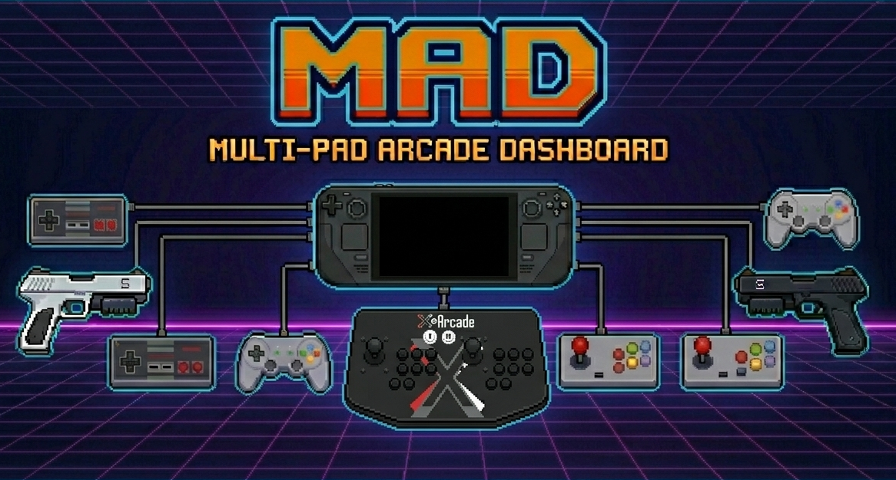

<p align="center">
  
</p>

<h1 align="center">ES-DE — Steam Deck / MAD fork</h1>

<p align="center">
  A lightly source-patched fork of <a href="https://es-de.org">ES-DE</a>
  (EmulationStation Desktop Edition) — the frontend engine behind
  <b><a href="https://github.com/mmadalone/mad/tree/main">MAD</a></b>,
  the Multi-Pad Arcade Dashboard, on the Steam Deck.
</p>

---

> This is the **`deck-patches`** branch — the patched ES-DE **source**. The MAD control panel, controller router and tools live on the [**`main`**](https://github.com/mmadalone/mad/tree/main) branch.

## What this is

A handful of small, self-contained patches on top of upstream ES-DE **v3.4.1** (tagged `base/v3.4.1`) — each a single commit, so they rebase cleanly onto new ES-DE releases. They add the few hooks MAD needs that stock ES-DE doesn't expose, plus Steam Deck quality-of-life. The resulting AppImage is what MAD runs as `~/Applications/ES-DE-MAD.AppImage`.

## The patches

| Patch | Why |
|---|---|
| **`arg5`** — 5th arg to `Scripting::fireEvent` + pass the *launched-from* custom collection to game-start scripts | Launch screens & the controller router need to know which collection a game was launched from |
| **Full-screen splash** | Edge-to-edge custom startup splash on the Deck |
| **Honour `es_systems_sorting.xml` for custom collections** | Stable custom-collection ordering |
| **MAD menu rows** — "MAD CONTROL PANEL" (Utilities) + "Restart Steam (fix audio)" (Quit) | Launch MAD / recover audio from inside ES-DE |
| **Drop queued input after a long pause** | No replay of buffered presses after returning from a launched game (>500 ms loop gap) |
| **Native PauseGames** (Steam Deck) — block input & pause gamelist preview videos while the Steam overlay/QAM holds gamescope keyboard focus; swallow the Guide-button chord (Guide+X) | Stop ES-DE navigating behind the overlay *without* the SDH-PauseGames Decky plugin (ES-DE runs with Steam Input off, so it reads raw evdev). Polls gamescope's root atoms on the primary X server; self-disables off gamescope. Covers general overlay + backgrounding — the handful of game-context overlay spots (home/notes/guide/resume) are atom-identical to true focus, so those stay the Decky plugin's job |

Exact commits: `git log base/v3.4.1..deck-patches`.

## Building

**CI (normal path):** every push to this branch runs a [GitHub Actions workflow](.github/workflows/build-appimage.yml) that builds the AppImage on Ubuntu 22.04 (glibc 2.35 → runs on SteamOS) with ES-DE's own `tools/create_AppImage_SteamDeck.sh`, *verbatim*, and publishes it to the rolling [`latest-steamdeck`](https://github.com/mmadalone/mad/releases/latest) release. On the Deck, [`deck-fetch-esde.sh`](https://github.com/mmadalone/mad/blob/main/deck-fetch-esde.sh) downloads it — so you normally never build by hand.

To build **locally** in an `esde-ubuntu` [distrobox](https://distrobox.it) (the same recipe the CI runs; ES-DE needs an Ubuntu toolchain since SteamOS's root is immutable):

```bash
cd ~/esde-build/ES-DE
git checkout deck-patches
distrobox enter esde-ubuntu -- bash ~/esde-build/ubuntu-build.sh   # → ES-DE_x64_SteamDeck.AppImage
```

Install it as `~/Applications/ES-DE-MAD.AppImage`. A tiny wrapper at `~/Applications/ES-DE.AppImage` regenerates the splash and runs the build from a **permanently extracted AppDir** rather than FUSE-mounting the AppImage — otherwise the squashfuse `/tmp/.mount_ESDE*` mount deadlocks a native Steam game launched from ES-DE (its pressure-vessel container sees `/tmp` and its asset loader blocks forever on the FUSE daemon). The wrapper re-extracts automatically when the AppImage changes and keeps the stock AppImage as `.real`.

## Keeping up with upstream

```bash
git fetch upstream --tags
git rebase --onto <new-tag> base/v3.4.1 deck-patches
# resolve each patch with full context (a textual rebase is not a semantic one),
# then rebuild + on-Deck test, and tag deck/<upstream>-<n>.
```
Pushing the rebased branch triggers the CI to build and publish the new AppImage automatically.

## Credits & licence

A fork of [**ES-DE**](https://es-de.org) (EmulationStation Desktop Edition) by Leon Styhre — all credit for ES-DE itself goes upstream:
[Website](https://es-de.org) · [GitLab](https://gitlab.com/es-de/emulationstation-de) · [Patreon](https://www.patreon.com/es_de) · [YouTube](https://www.youtube.com/@ES-DE_Frontend).
This fork only adds the commits listed above; ES-DE's full documentation lives upstream. See `LICENSE`.
